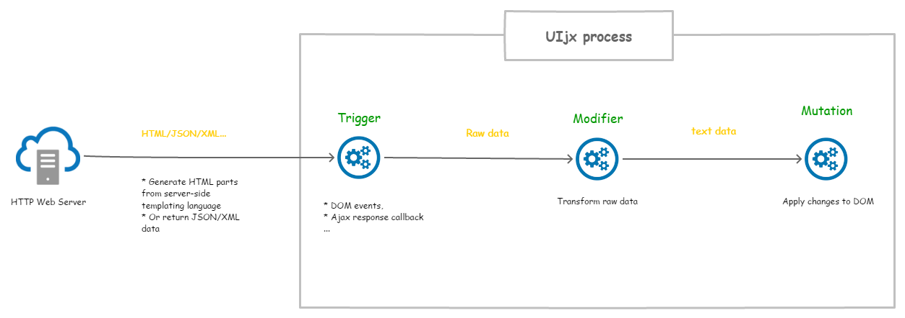

UIjx toolkit
============

Uijx is a simple toolkit for building reactive web apps from your favorite server side templating engine.

## Why UIjx ?

Sveltejs, vuejs, react, angular ... are great tools for creating a responsive web application, but these tools require additional skills and basics that are not available neccessarily.

The idea of ​​the UIjx project is to design responsive web applications directly from its favorite server-side template language (Twig, Blade, Razor, JSF, ...), so a backend developer can build an single page application without going through a component-based UI framework.

## Concept



Basic UIjx concepts:

- Triggers : as its name implies, this component attached to a DOM node (called "Slot") has the role of triggering task on specifics occasions (event of the DOM, ajax response callback ...) and generating raw data from various sources.
- Modifiers : This component transforms incoming data and outputs the result. Modifiers can be combined.
- Mutations : This component represents an alteration of the DOM.

## Installation

Download the latest [release](https://github.com/mbo2olivier/uijx/releases) of UIjx, move it to your assets folder and add the library to your base layout template like this:

``` html
<script src="assets/js/uijx/dist/uijx.min.js"></script>
```
And that's all

## Usage

Working with UIjx will consist most of the time of adding annotations to your HTML tags. These annotations come in the form of attributes of type `data-*`.
In the example below, when clicking on the link UIjx will issue a request to the URL and replace the contents of the tag `#target` by the result:

``` html
...
<div id="app-container">
    
    <a href="http://www.foo.bar" data-uijx-link ="() ->-> #target:replace">replace content</a>
    <div id="target"></div>
</div>
...
<script src="uijx.min.js"></script>
```