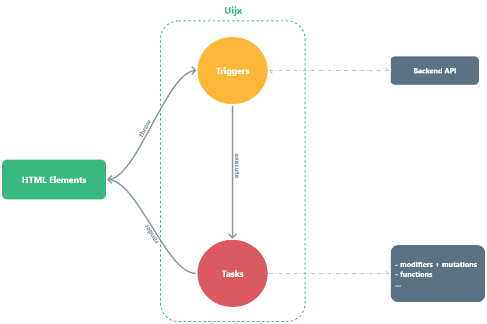

UIjx toolkit
============

Uijx is a simple toolkit for building reactive web apps from your favorite server-side templating engine.

## Why UIjx ?

Sveltejs, vuejs, react, angular ... are great tools for creating a reactive web application, but these tools require additional skills and basics that are not available neccessarily.

The idea of ​​the UIjx project is to design reactive web applications directly from its favorite server-side templating language (Twig, Blade, Razor, JSF, ...), so a backend developer can build an single page application without going through a component-based UI framework.

In addition, UIjx is unobtrusive : you use `data-*` type HTML attributes to describe interaction you want in a very intuitive way.

## Main Concepts



Basic UIjx concepts:

- Trigger : as its name implies, It is a command that describes the way a task should be triggered, it can be a DOM event, an ajax callback response etc...
- Tasks : It's the core of the UIjx library, *tasks* is used to describe the interaction of your application.

## Installation

Download the latest [release](https://github.com/mbo2olivier/uijx/releases) of UIjx, move it to your assets folder and add the library to your base layout template like this:

``` html
<script src="assets/js/uijx/dist/uijx.min.js"></script>
```
And that's all

## First example

Working with UIjx will consist most of the time of adding annotations to your HTML tags. These annotations come in the form of attributes of type `data-*`.
In the example below, when clicking on the link UIjx will issue a request to the URL and replace the contents of the tag `#target` by the result:

``` html
...
<div id="app-container">
    
    <a href="http://www.foo.bar" data-uijx-link ="() ->-> #target">replace content</a>
    <div id="target"></div>
</div>
...
<script src="uijx.min.js"></script>
```